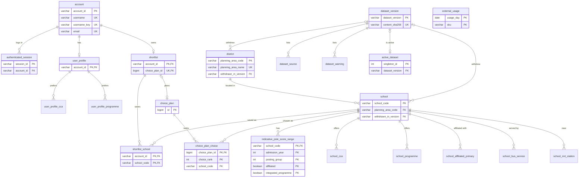

# SchoolMatch SG: database design

Branch `feat/postgresql`, 4 Oct 2026. **As built** (implementation steps 1–8 of section 11 are done). The DDL is the three Flyway migrations in [`src/main/resources/db/migration`](../src/main/resources/db/migration); the earlier `database-schema.sql` held exactly the same three files and was removed (section 8). Design changes DC-83 to DC-86 are logged in [`design-changes.md`](design-changes.md) and wait for team approval like every other DC row. Where the build differs from the first design, the text below says so, and section 14 lists every difference with its reason.

**How the design was checked before it was built.**

- The DDL was run through Flyway 12.4.0 (the version Spring Boot 4.1.1 uses) on two databases: H2 2.4.240 in PostgreSQL mode, and PostgreSQL 17.6.
- Both databases were loaded with the real snapshot of that day, `2026-10-03.5` (15,309 rows), and with `0000-seed`.
- 32 bad rows were tried, and the database rejected every one of them.
- These scenarios behaved as designed: a school is withdrawn, a school gets a new code, the dataset is rolled back, an account is deleted.
- Hibernate 7.4.5 `validate` passes for the seven JPA entities on both databases.
- Both databases gave the same results. A later review found one difference these rows did not try: H2 accepted a format value with a trailing line break, such as `'ACTIVE'` plus a newline, which PostgreSQL refuses. The format CHECKs now refuse it on both (section 8).

**How the build is checked.** `./mvnw verify` runs about 1,450 tests. The database tests run twice, on H2 2.4.240 and on embedded PostgreSQL 17.11 (section 10):

- `MigrationsTest`: V1–V3 apply on a connection that is then closed, Hibernate validates, the columns and constraint names are the same on both databases, and 94 bad rows are each refused with the expected constraint named.
- The loader, the read path and the round trip run on both databases with the seed, both test fixtures and the real `ACTIVE` snapshot `2026-10-04.1`.
- The whole app starts on embedded PostgreSQL, once with the test settings and once each with the `postgres` and `prod` profiles.
- By hand on 4 Oct 2026: the packaged app on Docker `postgres:17-alpine` through `compose.yaml` and the `postgres` profile applied V1–V3, loaded `2026-10-04.1` and served home, search, details, map, about, login and register; the database refused a saved school code that names no school.
- By hand, on a dev H2 file: a test member saved a school in the shortlist and the plan. After the school row was marked withdrawn, the restart loaded nothing (`UNCHANGED`, 146 schools served), the school's details page gave 404, and both the shortlist and the plan showed its last-known name next to its code. A manual `DELETE` of that school was refused by `fk_shortlist_school_school`.

## Contents

1. [Purpose and scope](#1-purpose-and-scope)
2. [What is stored, and what is not](#2-what-is-stored-and-what-is-not)
3. [ER overview](#3-er-overview)
4. [Tables](#4-tables)
5. [BCNF](#5-bcnf)
6. [School data: snapshot, loader, versions, lifecycle](#6-school-data-snapshot-loader-versions-lifecycle)
7. [Mapping classes to tables](#7-mapping-classes-to-tables)
8. [Flyway layout](#8-flyway-layout)
9. [Profiles and configuration](#9-profiles-and-configuration)
10. [Testing plan](#10-testing-plan)
11. [Implementation steps](#11-implementation-steps)
12. [Open decisions for the team](#12-open-decisions-for-the-team)
13. [Design changes to log, and risks](#13-design-changes-to-log-and-risks)
14. [As built: differences from the first design](#14-as-built-differences-from-the-first-design)

---

## 1. Purpose and scope

**Before this change.**

- Hibernate created the user tables in H2 at start-up (`ddl-auto: update`).
- School data was a JSON snapshot in git (`data/snapshots/<version>/`), read into memory at start-up and never written to the database.

**Now.**

- One PostgreSQL schema holds both the user data and the school data.
- The schema is created by Flyway, a library that runs numbered SQL files ("migrations") once each, in order, and records which ones ran in the table `flyway_schema_history`.
- Hibernate only checks the schema (`ddl-auto: validate`): at start-up it confirms that every JPA entity's tables and columns exist with compatible types, and it changes nothing.

**Why school data was not in the database before.** The Lab 2 design treated school data as a read-only published dataset:

- A JSON snapshot in git gave a reviewable diff for every data change.
- The app started offline.
- Search ran in memory.

Nothing in the database pointed at a school, so storing it there added nothing then.

**Why it moves in now.**

- **One source of truth.** A deployed app needs the school data in the database with the user data.
- **Real links.** Shortlists and plans get foreign keys to real schools. Today any string is accepted as a school code.
- **Recorded history.** The database records which dataset version is live, when it was loaded, and which schools left the dataset.
- **Plain SQL.** The team (and the report) can query school data with SQL.

**What stays the same.**

- The importer still writes the reviewable JSON snapshot into git.
- `SchoolDataCache` still keeps every school in memory, so a name search stays well under 1 s (NFR-PERF-01). Its source becomes the database instead of the files.

**Out of scope.**

- The deployment itself (section 12).
- Map queries in SQL (PostGIS): the boundary tests keep running in memory with JTS.
- Anything from Google.

**Terms used below.**

| Term | Meaning |
|:--:|:--:|
| H2 PostgreSQL mode | H2 is a Java database that runs inside the app; with `MODE=PostgreSQL` it accepts PostgreSQL-style SQL |
| embedded PostgreSQL | a real PostgreSQL server that a test starts from a binary downloaded by Maven (`io.zonky.test:embedded-postgres`); no installation, no Docker |
| withdrawn | a school or planning area that was in an earlier dataset but not in the active one; its row stays, marked with `withdrawn_in_version` |
| idempotent | running it again changes nothing |

## 2. What is stored, and what is not

### 2.1 Stored

| Data | Tables | Written by | Read by |
|:--:|:--:|:--:|:--:|
| Accounts and logins | `account`, `authenticated_session` | `AccountController`, `AuthController` (JPA) | same |
| Profiles | `user_profile`, `user_profile_cca`, `user_profile_programme` | `ProfileController` (JPA) | profile, recommendations, plan |
| Shortlists and plans | `shortlist`, `shortlist_school`, `choice_plan`, `choice_plan_choice` | `ShortlistController`, `ChoicePlanController` (JPA) | same |
| Google usage counters | `external_usage` | `ExternalCallBudget` (JPA) | same |
| Dataset versions | `dataset_version`, `dataset_source`, `dataset_warning`, `active_dataset` | the loader (JDBC) | `SchoolDataController` → about page, footer |
| Planning areas | `district` | the loader | `SchoolDataController` → map, filters |
| Schools | `school`, `indicative_psle_score_range`, `school_cca`, `school_programme`, `school_affiliated_primary`, `school_bus_service`, `school_mrt_station` | the loader | `SchoolDataController` → every school page |

Real volumes in the active snapshot `2026-10-04.1` (the same school data as `2026-10-03.5`, on which the design was checked):

| Data | Count |
|:--:|:--:|
| Schools | 147 |
| Planning areas | 55 |
| PSLE ranges | 444 (139 schools) |
| CCA rows | 3,774 (169 distinct names) |
| Programme rows | 9,103 (803 distinct names) |
| Affiliation rows | 39 (27 schools) |
| Bus service rows | 1,492 |
| MRT station rows | 243 |

### 2.2 Not stored, and why

| Data | Where it lives | Why not in the database |
|:--:|:--:|:--:|
| Facilities (`Facility`, `FacilityDataCache`) | memory, 24 h | Google Places terms forbid storing their content (DC-17) |
| Routes and travel times (`Route`, `RouteStep`, route matrix) | memory, 30 min (DC-63) | Google terms; recomputed per request |
| Recommendations (`Recommendation`, `ScoreComponent`) | HTTP session `sm.recommendations` (DC-54) | built from Google travel times, which may not be stored; can be recomputed |
| Search state (`CurrentResultSet`, filters, `MatchCriteria`, `SortOrder`, radius) | the request URL (DC-15) | rebuilt on every request |
| Start location, address candidates, flash messages | HTTP session | per-browser page state, cleared at logout (DC-71) |
| OneMap search answers | memory, 24 h | a lookup cache; the one coordinate a member saves goes into `user_profile` |
| Passwords, API keys | nowhere | NFR-SEC-01; only the BCrypt hash is stored; keys stay in `.env` |
| Curation records (`entered_by`, `checked_by`, `reason`, MOE `source_url`), `import-log.txt`, `validation-report.md` | git | review records, checked in pull requests; the app never reads them |

### 2.3 Computed, not stored

These values follow from stored ones. Storing them would let the copies disagree.

| Value | Computed from |
|:--:|:--:|
| `School.planningArea` (the name) | `district.planning_area_name`, through `school.planning_area_code` |
| `School.ipRangeNote` | the school's Integrated Programme ranges: `IP <year> PG<pg>[ affiliated]: <MOE text>`, joined by `; `, newest year first, non-affiliated first. This matches all 16 notes in the snapshot |
| `School.busInfo`, `School.nearestMrt` | the list rows joined with `, ` |
| `IndicativePsleScoreRange.moeText` | lower and upper score, the two Higher Chinese grades, and the `*` flag (section 5.2) |
| Manifest `counts` | row counts of the loaded data; the loader checks that they match |
| `complete` inside `schools.json` ranges | `ScoreRangeRecord.isComplete()` written out by Jackson by mistake; gets `@JsonIgnore` |
| SAFE / MATCH / REACH, `isOutdated`, `hasPsleData` | computed per request |

## 3. ER overview

Key columns only; section 4 lists every column. `PK` = primary key, `FK` = foreign key, `UK` = unique.



`external_usage` stands alone: it counts Google calls and refers to nothing.

## 4. Tables

`NN` = `NOT NULL`. All `school_code` columns are `VARCHAR(100)`, all `dataset_version` columns `VARCHAR(40)`, all timestamps `TIMESTAMP(6) WITH TIME ZONE` (Java `Instant`). Every constraint has a name: `pk_`, `uq_`, `fk_`, `ck_`, `ix_` + table.

### 4.1 User data (V1, mapped by JPA)

Column names and types equal Hibernate's own DDL for the entities, so no entity changed. The keys and CHECKs are new; each repeats a rule the Java code already enforces.

| Table | Columns | Keys | Checks, foreign keys, indexes |
|:--:|:--:|:--:|:--:|
| `account` | `account_id` VARCHAR(36) NN, `username` VARCHAR(30) NN, `username_key` VARCHAR(30) NN, `email` VARCHAR(254) NN, `password_hash` VARCHAR(100) NN, `created_at` NN, `status` VARCHAR(16) NN | PK `account_id`; UK `username`; UK `username_key`; UK `email` | `username_key = LOWER(TRIM(username))` (DC-70); `status` is `ACTIVE` or `INACTIVE` |
| `authenticated_session` | `session_id` VARCHAR(64) NN, `account_id` NN, `issued_at` NN, `expires_at` NN, `invalidated` BOOLEAN NN | PK `session_id` | FK `account` CASCADE; `expires_at >= issued_at`; indexes on `account_id` and `expires_at` (DC-73 clean-up) |
| `user_profile` | `account_id` NN, `display_name` VARCHAR(50), `psle_score` INT, `posting_group` INT, `primary_school` VARCHAR(100), `home_address` VARCHAR(200), `home_latitude`, `home_longitude` DOUBLE, `max_commute_min` INT, `travel_mode` VARCHAR(16) | PK `account_id` | FK `account` CASCADE; score 4–32; PG 1–3; commute 15/30/45/60; mode `WALK`/`DRIVE`/`TRANSIT`; both coordinates or neither; coordinate inside Singapore's box |
| `user_profile_cca`, `user_profile_programme` | `account_id` NN, `cca` / `programme` VARCHAR(255) NN | PK both columns | FK `user_profile` CASCADE; no FK to school data (a preference survives a dataset change, DC-57) |
| `choice_plan` + sequence `choice_plan_seq` (step 50) | `id` BIGINT NN, `based_on_score` INT, `posting_group` INT, `updated_at` | PK `id` | score 4–32; PG 1–3 |
| `choice_plan_choice` | `choice_plan_id` NN, `choice_rank` INT NN, `school_code` NN | PK (`choice_plan_id`, `choice_rank`); UK (`choice_plan_id`, `school_code`) | FK `choice_plan` CASCADE; FK `school` RESTRICT (V3); rank 1–6; index on `school_code` |
| `shortlist` | `account_id` NN, `updated_at`, `choice_plan_id` BIGINT | PK `account_id`; UK `choice_plan_id` | FK `account` CASCADE; FK `choice_plan` SET NULL |
| `shortlist_school` | `account_id` NN, `school_code` NN | PK both columns | FK `shortlist` CASCADE; FK `school` RESTRICT (V3); index on `school_code` |
| `external_usage` | `usage_day` DATE NN, `sku` VARCHAR(50) NN, `used` INT NN | PK (`usage_day`, `sku`) | `used >= 0` |

### 4.2 School data (V2, written by the loader with JDBC)

| Table | Columns | Keys | Checks, foreign keys |
|:--:|:--:|:--:|:--:|
| `dataset_version` | `dataset_version` NN, `dataset_kind` VARCHAR(4) NN, `effective_date` DATE NN, `imported_at` NN, `manifest_status` VARCHAR(24), `load_status` VARCHAR(24) NN, `notes` VARCHAR(2000), `content_sha256` VARCHAR(64) NN, `loader_format` INT NN, `loaded_at` NN | PK `dataset_version`; UK `content_sha256` | name `^[A-Za-z0-9._-]+$`; kind `seed`/`full`; `load_status` `PASSED` or `PASSED_WITH_WARNINGS` (a FAILED snapshot never gets a row); hash is 64 lower-case hex digits |
| `dataset_source` | `dataset_version` NN, `source_no` INT NN, `source_id` VARCHAR(80) NN, `source_name` VARCHAR(300) NN, `downloaded_at` | PK (`dataset_version`, `source_no`); UK (`dataset_version`, `source_id`) | FK `dataset_version` CASCADE; `source_no >= 1` (manifest order) |
| `dataset_warning` | `dataset_version` NN, `warning_no` INT NN, `message` VARCHAR(1000) NN | PK (`dataset_version`, `warning_no`) | FK `dataset_version` CASCADE |
| `active_dataset` | `singleton_id` INT NN, `dataset_version` | PK `singleton_id` | `singleton_id = 1` (exactly one row, inserted by V2); FK `dataset_version` RESTRICT |
| `district` | `planning_area_code` VARCHAR(10) NN, `planning_area_name` VARCHAR(60) NN, `boundary_geojson` VARCHAR(100000), `withdrawn_in_version` | PK `planning_area_code`; UK `planning_area_name` | FK `dataset_version` RESTRICT |
| `school` | `school_code` NN, `school_name` VARCHAR(200) NN, `address` VARCHAR(200), `postal_code` VARCHAR(6), `latitude`, `longitude` DOUBLE NN, `telephone` VARCHAR(40), `website` VARCHAR(200), `email` VARCHAR(254), `school_type` VARCHAR(60), `session_type` VARCHAR(40), `school_nature` VARCHAR(40), `planning_area_code` NN, `withdrawn_in_version` | PK `school_code` | FK `district` RESTRICT; FK `dataset_version` RESTRICT; code `^[a-z0-9-]+$`; postal code 6 digits; coordinate inside Singapore's box (FR-DATA-06) |
| `indicative_psle_score_range` | `school_code` NN, `admission_year` INT NN, `posting_group` INT NN, `affiliated` BOOLEAN NN, `integrated_programme` BOOLEAN NN, `lower_score` INT NN, `upper_score` INT NN, `lower_hcl_grade` VARCHAR(1), `upper_hcl_grade` VARCHAR(1), `places_left` BOOLEAN | PK (`school_code`, `admission_year`, `posting_group`, `affiliated`, `integrated_programme`) | FK `school` CASCADE; year 2022–2100 (AL scores); PG 1–3; 4 ≤ lower ≤ upper ≤ 32; IP only in PG3 (DC-77); grades `D`/`M`; grades only when `places_left` is known |
| `school_cca` | `school_code` NN, `cca_name` VARCHAR(100) NN | PK both columns | FK `school` CASCADE |
| `school_programme` | `school_code` NN, `programme_name` VARCHAR(100) NN | PK both columns | FK `school` CASCADE |
| `school_affiliated_primary` | `school_code` NN, `primary_school_name` VARCHAR(120) NN | PK both columns | FK `school` CASCADE |
| `school_bus_service` | `school_code` NN, `service_no` VARCHAR(10) NN, `list_position` INT NN | PK (`school_code`, `service_no`); UK (`school_code`, `list_position`) | FK `school` CASCADE; `service_no` matches `^[A-Z]{0,2}[0-9]{1,3}[A-Za-z]?$` (`904`, `70M`, `74e`, `CT18`); position ≥ 1 |
| `school_mrt_station` | `school_code` NN, `station_name` VARCHAR(80) NN, `list_position` INT NN | PK (`school_code`, `station_name`); UK (`school_code`, `list_position`) | FK `school` CASCADE; no comma in a name (one station per row); position ≥ 1 |

### 4.3 Delete rules

| Child → parent | Rule | Why |
|:--:|:--:|:--:|
| sessions, profile, shortlist → `account` | CASCADE | deleting an account removes the member's data |
| profile preferences → `user_profile`; `shortlist_school` → `shortlist`; `choice_plan_choice` → `choice_plan`; school child tables → `school`; `dataset_source`, `dataset_warning` → `dataset_version` | CASCADE | parts of the parent (composition) |
| `shortlist.choice_plan_id` → `choice_plan` | SET NULL | the plan can be removed alone; JPA `orphanRemoval` clears it first anyway |
| `shortlist_school`, `choice_plan_choice` → `school` | RESTRICT | school rows are never deleted, only withdrawn (section 6.4) |
| `school` → `district`; `withdrawn_in_version`, `active_dataset` → `dataset_version` | RESTRICT | history must not vanish |

Known limit: deleting an account leaves its `choice_plan` row, because the key points from `shortlist` to `choice_plan`. There is no account-deletion feature yet (section 12).

### 4.4 Indexes

Search, filtering and sorting run in memory, so the database needs few indexes:

- primary and unique keys (login by `username_key` or `email`, session by `session_id`);
- `authenticated_session (expires_at)` for the hourly clean-up, `authenticated_session (account_id)`;
- `shortlist_school (school_code)` and `choice_plan_choice (school_code)`. The loader uses them to count how many members saved a school that it withdraws.

## 5. BCNF

**Definitions.**

| Term | Meaning |
|:--:|:--:|
| Functional dependency (FD) `X → Y` | any two rows that agree on columns `X` also agree on `Y` |
| Trivial FD | `Y` is part of `X` |
| Candidate key | a smallest set of columns whose values identify one row |
| First normal form (1NF) | every column holds one value, not a list |
| Boyce–Codd normal form (BCNF) | for every non-trivial FD `X → Y`, `X` contains a candidate key; so every fact is stored once, in the table whose key it depends on |

### 5.1 Per table

In every row below, each determinant (left side of an FD) is a candidate key, so every table is in BCNF. "All-key" means the whole row is the key and no non-trivial FD exists.

| Table | Candidate keys | Non-trivial FDs |
|:--:|:--:|:--:|
| `account` | {`account_id`}, {`username`}, {`username_key`}, {`email`} | each key → every other column (`username → username_key` is the DC-70 derivation; `username` is a key, so it is allowed) |
| `authenticated_session` | {`session_id`} | `session_id → account_id, issued_at, expires_at, invalidated` |
| `user_profile` | {`account_id`} | `account_id →` every other column |
| `user_profile_cca`, `user_profile_programme` | {both columns} | none (all-key) |
| `choice_plan` | {`id`} | `id → based_on_score, posting_group, updated_at` |
| `choice_plan_choice` | {`choice_plan_id`, `choice_rank`}, {`choice_plan_id`, `school_code`} | each key → the remaining column |
| `shortlist` | {`account_id`}; `choice_plan_id` is a key among rows where it is not null | `account_id → updated_at, choice_plan_id`; `choice_plan_id → account_id` |
| `shortlist_school` | {both columns} | none (all-key) |
| `external_usage` | {`usage_day`, `sku`} | key → `used` |
| `dataset_version` | {`dataset_version`}, {`content_sha256`} | each key → every other column (the hash covers `manifest.json`, which contains the version) |
| `dataset_source` | {`dataset_version`, `source_no`}, {`dataset_version`, `source_id`} | each key → `source_name, downloaded_at` and the other key's column |
| `dataset_warning` | {`dataset_version`, `warning_no`} | key → `message` |
| `active_dataset` | {`singleton_id`} | `singleton_id → dataset_version` |
| `district` | {`planning_area_code`}, {`planning_area_name`} | each key → every other column |
| `school` | {`school_code`} | `school_code →` every other column; no other column determines anything (5.2) |
| `indicative_psle_score_range` | {`school_code`, `admission_year`, `posting_group`, `affiliated`, `integrated_programme`} | key → `lower_score, upper_score, lower_hcl_grade, upper_hcl_grade, places_left` |
| `school_cca`, `school_programme`, `school_affiliated_primary` | {both columns} | none (all-key) |
| `school_bus_service`, `school_mrt_station` | {`school_code`, value}, {`school_code`, `list_position`} | each key → the remaining column |

### 5.2 Hard cases, checked against the real data

| Case | What the data shows | Decision |
|:--:|:--:|:--:|
| MOE range text (`moeText`) next to the scores | All 444 texts match `^(\d+)(\([DM]\))? - (\d+)(\([DM]\))?(\*)?$`, and the numbers always equal `lowerScore` / `upperScore`. Forms: `N - N` (401), `N - N*` (28), `N(D) - N(M)` (8), `N(M) - N(M)` (4), `N(M) - N` (3); 113 distinct texts. | The text packs five facts into one value (not 1NF), and `moe_text → lower_score, upper_score` has a determinant that is not a key (not BCNF). It is stored as `lower_score`, `lower_hcl_grade`, `upper_score`, `upper_hcl_grade`, `places_left`, and `MoeRangeText.format(...)` rebuilds all 444 texts exactly. `places_left` NULL means "MOE text unknown" (all 29 ranges in the seed and test fixtures), so `getMoeText()` still returns null there (TC-IndicativePsleScoreRange-05). New validator error `moe-text-format` rejects any other text, so nothing is lost silently. |
| Bus and MRT text (`busInfo`, `nearestMrt`) | 140 of 147 bus texts are clean comma lists. 7 are not: `SBS Transit No 170, …, 963 & 970`, `243G/W`, `14E 16`, `Yishun Street 61 (opposite school) - 812`, `962 (Bus Stop IDs: …)`, `Bus Service along Tampines Ave 9: 18, 29 and 29A`, and Outram's campus labels. 72 schools list several MRT stations; NUS High (`Clementi and Dover`) and Outram (campus labels) are irregular, and Dunman High has a trailing comma. | Lists break 1NF. They become child tables with `list_position` (published order): 1,492 bus rows and 243 MRT rows. The importer splits the text and writes arrays into the snapshot (section 6.1); the 9 irregular texts get explicit rows in a curated file. |
| `ipRangeNote` | Rebuilt from the IP ranges, it equals the snapshot value for all 147 schools (16 have one). | Derived; not stored (2.3). |
| `planningAreaName` next to the code | Code ↔ name is one-to-one (55 areas). | `school_code → planning_area_code → planning_area_name` is transitive, so the name lives only in `district`. |
| `postal_code → address` or coordinate? | 147 distinct postal codes, addresses and coordinates. The address carries unit numbers (`1 Zubir Said Drive 05 01`). The coordinate is chosen per school, either by the OneMap hit whose building name matches the school or by a `geocode-overrides.csv` row. | Not an FD of the design. Two schools on one campus could share a postal code and still get different points. `postal_code` stays a plain column, not unique. |
| (`latitude`, `longitude`) → `planning_area_code`? | The importer finds the area with the full URA boundaries and falls back to `dgp_code` when a point is in no area. The stored boundaries are simplified, and the importer warns when a school ends up just outside its own simplified area. | Not an FD of the stored data: the area cannot be recomputed from stored rows. Keeping `planning_area_code` is correct. |
| `school_name` as a key? | 147 distinct names today. | Not declared unique. A withdrawn row keeps its name, so a school that gets a new code would clash (checked). New validator error `duplicate-name` checks the schools of one snapshot. |
| `username → username_key` | `username_key = lower(trim(username))` (DC-70). | Both are candidate keys, so this is BCNF. A unique index on `LOWER(username)` would remove the column, but H2 has no expression indexes; the CHECK keeps the copy right. |
| MOE SchoolFinder URL | In `psle-ranges.csv` and `affiliations.csv` every row's `source_url` equals the school's URL in `school-codes.csv` (444 + 39 rows). 11 of 147 URLs cannot be built from the code. | `school_code → url`, so on range rows it would repeat (not 2NF). The snapshot does not carry it today; if it is ever shown, it becomes a nullable, non-unique `school` column (section 12). |
| `school_type`, `school_nature`, `session_type` | 5, 3 and 2 values (`GOVERNMENT-AIDED SCH` is MOE's own cut-off text). | No column depends on them, so plain columns are BCNF. A lookup table would add a join and break loading when MOE adds a value; the filter options come from the data (FR-FILTER-02). |
| `source_id → source_name`? | Not across versions: the seed says "Master Plan 2019 Planning Area Boundary", the active snapshot adds "(No Sea)"; Subjects was renamed (DC-76). | The name stays in `dataset_source`, keyed by version. |
| CCA, programme and affiliation names | No duplicates within a school. 6 primary schools are affiliated with 2 secondary schools each. | All-key link tables. No `cca` master table: a name is its own identifier, and no other fact depends on it. `user_profile.primary_school` stays free text (DC-82 compares names by rule). |
| Telephone `64582177 (Secondary)`, `+65 69296290`, `6338 9663` | 142 are plain 8-digit numbers; 5 carry a label or spacing; each is one number. | One value per school (1NF holds). Stored as published. |
| `home_address → home coordinate`? `psle_score → posting_group`? | The member picks one of up to 5 OneMap matches (DC-47). Real ranges overlap across posting groups (e.g. PG3 16–22, PG2 21–25). | Not FDs. Both pairs stay in `user_profile`. |
| `choice_plan.based_on_score` vs `user_profile.psle_score` | The plan keeps the score it was made for (DC-65). | A different fact, not a copy. |
| `integrated_programme → posting_group`? (`posting_group`, `upper_score`) `→ places_left`? | IP ranges are always PG3, but non-IP ranges have every PG. 28 PG1 ranges with upper 30 have `*`, 2 do not. | Not FDs. The IP rule is a CHECK (`integrated_programme = FALSE OR posting_group = 3`). |
| `entered_by`, `checked_by` | Process facts about CSV rows. | Not stored (data minimisation, not a normal-form issue). The importer keeps only checked rows. |
| District boundary | One GeoJSON geometry per area (46 Polygon, 9 MultiPolygon, at most 16,355 characters), never queried by part. | One value of a spatial type, so 1NF holds. |

## 6. School data: snapshot, loader, versions, lifecycle

### 6.1 Snapshot format 2 (DC-84)

**What changes in the snapshot.**

- `schools.json` gets `busServices` and `mrtStations` (string arrays, published order) instead of the `busInfo` and `nearestMrt` strings.
- `manifest.json` gets `"formatVersion": 2`. A missing value means 1. The validator refuses format 1, because those snapshots have no arrays.
- The loader then copies the snapshot and parses nothing. What is reviewed in git is exactly what reaches the database.

**How the importer splits the text** (`dataset.TransportLists`):

- split on commas;
- trim each piece;
- drop empty pieces and repeated pieces.

**Rules every element must pass.**

- Bus: an element must match `^[A-Z]{0,2}[0-9]{1,3}[A-Za-z]?$`.
- MRT: an element must not contain `:`, ` - `, ` and `, `&` or `campus`.
- Both (as built): an element must not start or end with white space. The loader trims each element, so `"TAMPINES MRT"` and `"TAMPINES MRT "` would become the same key and the load would fail.

**Texts that break the rules.** A text with an element that fails needs a row in the new curated file `data/curated/transport-overrides.csv`:

- Columns: `school_code,kind,published_text,elements,reason`.
- `kind` is `bus` or `mrt`.
- `elements` are separated by `;`.

The override applies only while MOE's text is still exactly `published_text`. If the text has changed, the importer logs `transport-override-stale` and uses the plain split. The validator then fails the snapshot with `transport-list`, which names the school and the element. This is the same workflow as `geocode-overrides.csv`.

**Rows for today's data** (9 rows, written from the published text):

| School | Kind | Elements |
|:--:|:--:|:--:|
| `assumption-pathway-school` | bus | `170;67;75;171;176;178;184;961;963;970` |
| `boon-lay-secondary-school` | bus | the plain list with `243G;243W` in place of `243G/W` |
| `chung-cheng-high-school-main` | bus | `…;14E;16;…;43E;135;…;196A;197;…` |
| `chung-cheng-high-school-yishun` | bus | `812;39;85;117;…` |
| `outram-secondary-school` | bus | the 17 services (`123` once), without the campus labels |
| `spectra-secondary-school` | bus | `901M;962;904` |
| `temasek-junior-college` | bus | the 21 services, without the road labels |
| `nus-high-school-of-mathematics-and-science` | mrt | `Clementi;Dover` |
| `outram-secondary-school` | mrt | `OUTRAM PARK MRT (EW16);CHINATOWN MRT (DT19);CHENG LIM (SW1)` |

`School.busInfo` and `School.nearestMrt` keep their Lab 2 type (`String`): the reader and the mapper join the list with `", "`. 138 bus texts and 144 MRT texts display exactly as before. The other 12 lose only labels (campus names, bus-stop numbers, operator names), a repeated service, or a stray comma. A page check of all 147 detail pages after the re-import found exactly these 12 changed.

As built (section 14): the MRT rule ignores letter case (otherwise it misses "York Hill Campus") and also refuses a comma; the validator also refuses blank or repeated elements, and elements with leading or trailing white space, because the database keys each list by school and element. The re-import on 4 Oct 2026 made `2026-10-04.1`, whose data equals `2026-10-03.5` except for the lists.

The JSON may keep `planningAreaName` and `ipRangeNote` as copies for reviewers. The loader ignores them, and a test checks that they equal the computed values.

### 6.2 Loader

`persistence.dataset.SchoolDatasetStore.ensureLoaded(snapshot, report, sha256)` runs as one `@Transactional` method with plain JDBC (`NamedParameterJdbcTemplate`, batches of 500). It uses no `MERGE` or `ON CONFLICT`, so the same SQL runs on H2 and PostgreSQL.

1. `SchoolDataController` reads the `ACTIVE` folder (or `app.dataset.snapshot-location`) and validates it.
   - A FAILED snapshot stops start-up, as today.
   - It computes SHA-256 over `manifest.json` + byte 0 + `schools.json` + byte 0 + `districts.geojson`. `.gitattributes` forces LF line endings, so Windows and Mac get the same hash.
2. `SELECT dataset_version FROM active_dataset WHERE singleton_id = 1 FOR UPDATE`. This row lock makes a second app instance wait.
3. **Nothing to do** when the active version, its `content_sha256` and its `loader_format` all equal the snapshot's. Commit and stop. This is the normal start-up, and it takes milliseconds.
4. **Older snapshot.** If the snapshot's `importedAt` is older than the active version's and `app.dataset.allow-rollback` is false, keep the active version, log a WARN and stop.
   - This stops an old image that restarts during a rolling deploy from switching every instance back.
   - The setting is false only in `prod`.
5. Insert or update the `dataset_version` row.
   - It records kind (lower-cased), dates, both statuses, notes, hash, `loader_format` and `loaded_at = now`.
   - A known version with a different hash (a folder rebuilt in place) is reloaded with a WARN.
   - The version's `dataset_source` and `dataset_warning` rows are replaced.
   - The manifest counts must equal the snapshot's rows.
6. **Districts.** Update existing codes (`withdrawn_in_version = NULL`) and insert new ones. Areas missing from the snapshot get `withdrawn_in_version = <version>`.
7. **Schools.** Same rule: update existing codes, insert new ones, withdraw the missing ones. The loader logs every withdrawn code with the number of shortlist and plan rows that point at it.
8. **Child tables.** Delete all rows of the six school child tables, then batch-insert the snapshot's rows (about 15,000). Child rows therefore always belong to the active dataset; a withdrawn school keeps only its `school` row.
9. Set `active_dataset.dataset_version` and commit.

**As built** (section 14): `ensureLoaded` returns `Outcome` (`LOADED`, `UNCHANGED` or `KEPT_NEWER`). A FAILED report throws `IllegalArgumentException`; manifest counts that differ from the rows throw `IllegalStateException`, and the load rolls back. Timestamps are cut to microseconds to match `TIMESTAMP(6)`. The loader writes the values `SnapshotReader` puts into `School` and `District` (trimmed, blank as null), so the database holds what the pages show; the postal code, the area code and the lists come from the matching `SchoolRecord`.

**Properties.**

- Idempotent: step 3.
- One transaction: any failure rolls everything back, and the previous version stays active.
- Fast: about 1–2 s on the first start; later starts skip the load.

`SchoolDatasetStore.FORMAT` (stored as `loader_format`) goes up by one whenever the mapping from JSON to rows changes. An unchanged snapshot is then reloaded, so new columns are filled.

### 6.3 Serving

- After `ensureLoaded`, the cache is always built from the database (`readActive()`). That is about 10 SELECTs in one read-only transaction at REPEATABLE READ, so a load that another instance commits during the read cannot mix two versions.
- `SchoolDatasetMapper` builds `School`, `District`, `IndicativePsleScoreRange`, `SchoolDataCache` and the `SnapshotManifest` for the about page.
- Every `app.dataset.recheck-after` (1 h), the controller reads `active_dataset` and the version's hash. If either changed (another instance loaded a version), it rebuilds the cache from the database. The hourly check never reads files.
- A changed `ACTIVE` file is picked up on restart only (before this change: within an hour). The hourly check compares only the version and the hash: if another instance reloads the same version with a new `loader_format`, a running instance notices on its next restart.
- `app.dataset.load-on-startup` (default true):
  - `false` means: do not read snapshot files; build the cache from the database on first use.
  - The `import` profile sets it to false, so a new validator rule that rejects the current `ACTIVE` cannot stop the importer that would fix it.
- Sorting happens in Java, never through a text `ORDER BY`, because H2 and PostgreSQL sort text differently.
  - Schools: `BY_NAME_THEN_CODE`.
  - CCAs, programmes, affiliations: natural order (the snapshot's order today).
  - Bus and MRT: by `list_position`.
  - Ranges: the order of `SchoolDetailsUI.NEWEST_FIRST` (newest year, then PG3 to PG1). The mapper keeps its own copy, `RANGE_ORDER`, because `persistence` may not depend on `boundary.ui`.
  - Planning areas: by name, then code. The table keeps no position, so `/api/districts` lists the 55 areas in name order instead of data.gov.sg's order; no page shows that order.

### 6.4 School lifecycle

School codes are frozen (`school-codes.csv`), and shortlists and plans now hold foreign keys to `school`, so the loader never deletes a school.

| Event in a new snapshot | Loader | What members see |
|:--:|:--:|:--:|
| New code | insert school and child rows | – |
| Same code, new name, address or ranges | update `school`; replace child rows | shortlists follow the code |
| Code missing (school closed or merged) | set `withdrawn_in_version`; child rows removed; base row kept | the cache skips it, so the shortlist shows "no longer in the dataset" and the plan shows the DC-65 warning, as before; both pages now also show the school's last-known name next to its code (DC-86, open decision 3) |
| Code back (reopened or rollback) | `withdrawn_in_version = NULL` | shortlists resolve again |
| Code changed by mistake (the importer warns `school-code-slug`) | old code withdrawn, new code inserted (allowed: names are not unique) | the curator fixes `school-codes.csv` before the data PR; the loader log shows how many members saved the old code |
| Planning area missing | `district.withdrawn_in_version` set | the validator already requires every active school's area to be in the snapshot |

### 6.5 Rollback

1. In a PR, point `ACTIVE` back at the older folder. Restore the folder from git history if it was removed: `git checkout <commit> -- data/snapshots/<version>`.
2. Restart. In `prod`, set `DATASET_ALLOW_ROLLBACK=true` for that deploy.
3. The loader runs the normal path (section 6.2):
   - the old version's row already exists, so it is updated;
   - schools that are only in the newer version are withdrawn;
   - schools that came back are reactivated.

History rows are never deleted. Only format-2 snapshots can be loaded, so `2026-10-03.5` and older are no longer rollback targets; `2026-10-04.1` is the oldest real snapshot that is. [`data/README.md`](../data/README.md) ("Rollback") has the same steps for the data owner.

## 7. Mapping classes to tables

**Decision: the design classes stay exactly as in Lab 2.**

- User data keeps its JPA mapping, which already exists, is tested, and maps one class to one table.
- School data is read and written with JDBC through a mapper in `persistence.dataset`.

**Why school data does not use JPA.**

- The app only reads school data, and the loader replaces it as a whole. Batch SQL is simpler and faster than writing JPA entities.
- `School` and `IndicativePsleScoreRange` objects are shared by every request (README: "only SnapshotReader and SchoolDatasetMapper call School setters").
  - JPA would need no-argument constructors and non-final fields.
  - A managed entity changed by a stray setter would be written back to the database.
  - Objects built by a mapper can never be written back.
- `School` has six collections. Loading 147 schools with JPA, with open-in-view off, needs careful fetch settings to avoid one query per school or Hibernate's error for fetching several lists at once.
- `Place` is also the parent of `Facility`, which is never stored (DC-17). `District` keeps a cached JTS geometry.
- ArchitectureTest rule 4 (entities depend on nothing in the app) and rule 7 (the `entity` package holds exactly the design classes) stay unchanged.

### 7.1 Class ↔ table

| Lab 2 class | Table(s) | How |
|:--:|:--:|:--:|
| `Account` | `account` | JPA `@Entity` (unchanged) |
| `AuthenticatedSession` | `authenticated_session` | JPA (unchanged) |
| `UserProfile` (+ `Coordinate homeLocation`) | `user_profile`, `user_profile_cca`, `user_profile_programme` | JPA, `@Embedded` coordinate, two `@ElementCollection`s |
| `Shortlist` | `shortlist`, `shortlist_school` | JPA |
| `ChoicePlan` | `choice_plan`, sequence `choice_plan_seq` | JPA |
| `SchoolChoice` | `choice_plan_choice` | JPA `@Embeddable` in `ChoicePlan.choices` |
| `AccountStatus`, `TravelMode` | `account.status`, `user_profile.travel_mode` | stored by name |
| `ExternalUsage` (persistence, not a design class) | `external_usage` | JPA |
| `School` (+ `Place`, `Coordinate`) | `school` and its six child tables | JDBC + `SchoolDatasetMapper` |
| `IndicativePsleScoreRange` | `indicative_psle_score_range` | JDBC (composition part of `School`) |
| `District` | `district` | JDBC |
| `SchoolDataCache`, `ValidationStatus` | `dataset_version` (+ `active_dataset`) | JDBC; the cache itself stays in memory |
| `SnapshotManifest` (dataset package) | `dataset_version`, `dataset_source`, `dataset_warning` | JDBC; `counts` computed |
| `Facility`, `FacilityDataCache`, `Route`, `RouteStep`, `Recommendation`, `ScoreComponent`, `MatchCriteria`, `CurrentResultSet`, filters, `SortOrder`, `ReferenceLocation`, `AdmissionChance` | none | not stored (2.2) |

### 7.2 School attributes ↔ columns

| Attribute | Column |
|:--:|:--:|
| `School.schoolCode` | `school.school_code` |
| `Place.name`, `address`, `telephone`, `website`; `School.email` | `school.school_name`, `address`, `telephone`, `website`, `email` |
| `Place.coordinate` | `school.latitude`, `school.longitude` |
| `School.schoolType`, `sessionType`, `schoolNature` | `school.school_type`, `session_type`, `school_nature` |
| `School.planningArea` (name) | `district.planning_area_name` via `school.planning_area_code` |
| `School.ccas`, `programmes`, `affiliatedPrimarySchools` | `school_cca`, `school_programme`, `school_affiliated_primary` |
| `School.busInfo`, `nearestMrt` | `school_bus_service`, `school_mrt_station` rows, joined with `", "` |
| `School.scoreRanges` | `indicative_psle_score_range` |
| `School.ipRangeNote` | computed (`dataset.IpRangeNotes`) |
| `IndicativePsleScoreRange.admissionYear`, `postingGroup`, `affiliated`, `integratedProgramme`, `lowerScore`, `upperScore` | same-named columns |
| `IndicativePsleScoreRange.moeText` | rebuilt from `lower_hcl_grade`, `upper_hcl_grade`, `places_left` (`dataset.MoeRangeText`) |
| `District.planningAreaCode`, `planningAreaName`, `boundaryGeoJson` | `district.planning_area_code`, `planning_area_name`, `boundary_geojson` |
| `SchoolDataCache.datasetVersion`, `datasetKind`, `effectiveDate`, `importedAt`, `validationStatus` | `dataset_version.dataset_version`, `dataset_kind`, `effective_date`, `imported_at`, `load_status` |
| (stored, no design attribute yet) | `school.postal_code` |

### 7.3 New classes

```
persistence/dataset/
  SchoolDatasetStore    @Repository, NamedParameterJdbcTemplate: ensureLoaded(..) → Outcome, readActive(),
                        activeState(), schoolNames(codes) (last-known names, DC-86); FORMAT = 1
  SchoolDatasetMapper   rows → School, District, IndicativePsleScoreRange, SchoolDataCache, SnapshotManifest
  SnapshotRows          all rows of one dataset (what readActive() returns)
  *Row                  Java records, one per table (11)
dataset/
  TransportLists        split + overrides (importer, validator)
  MoeRangeText          parse / format MOE's range text (validator, loader, mapper)
  IpRangeNotes          the IP note text (importer, mapper); moved out of SchoolDataController
```

- Spring Boot runs Flyway before it creates the JDBC template beans, so the loader always sees a migrated schema.
- **New ArchitectureTest rule 9:** only `control.SchoolDataController` (and `persistence` itself) may use `persistence.dataset`. This turns "every other class reads schools through `SchoolDataController`" into a checked rule.
- The README rule "only SnapshotReader calls School setters" became "only SnapshotReader and SchoolDatasetMapper".
- As built, rule 9b also checks that `SchoolDataController` really uses `persistence.dataset`, so rule 9 cannot pass just because nothing uses the package.
- DC-86 adds `SchoolDataController.getLastKnownSchoolNames(codes)` and `ShortlistController.getLastKnownNames(codes)`; `ShortlistUI` and `ChoicePlanUI` put the result in the model as `missingNames`.

## 8. Flyway layout

```
src/main/resources/db/migration/
  V1__user_tables.sql          user tables (today's schema + keys and checks)
  V2__school_dataset.sql       school dataset tables + the active_dataset row
  V3__school_references.sql    foreign keys from shortlist_school and choice_plan_choice to school
```

**One folder for both databases.** Every migration runs on H2 in PostgreSQL mode (dev, demo, most tests) and on PostgreSQL (`postgres` and `prod` profiles, embedded test server). The migrations are the source of truth: the design's `database-schema.sql` held exactly these three files (checked byte for byte) and was removed in step 8. Its header, the rules for SQL that must run on both databases, is kept here:

- types: `VARCHAR(n)`, `INTEGER`, `BIGINT`, `BOOLEAN`, `DOUBLE PRECISION`, `DATE`, `TIMESTAMP(6) WITH TIME ZONE` only (no `TEXT`, `CHAR(n)`, `SMALLINT`, `ENUM`, arrays, `jsonb`);
- format checks use `REGEXP_LIKE` (H2 2.4 and PostgreSQL 15+), each paired with `NOT REGEXP_LIKE(col, '[^ -~]')` (below); no `translate()`, no `~` operator;
- no `col IN ('a', 'b')` and no `col = 'a' OR col = 'b'` inside a CHECK (below);
- no `ON CONFLICT`, `MERGE`, partial or expression indexes, `DEFERRABLE` constraints;
- every constraint has a name: `pk_` primary key, `uq_` unique, `fk_` foreign key, `ck_` check, `ix_` index;
- no reserved words as column names (`choice_rank`, `usage_day`, `admission_year`, `list_position` …).

One rule matters especially:

- H2 2.4.240 has a bug: a CHECK containing a list such as `status IN ('ACTIVE', 'INACTIVE')` (or `x = 'a' OR x = 'b'`) fails with "database has been closed" once the connection that created the table is closed.
- In the app, Flyway borrows a connection from Hikari, the connection pool. Once Hikari retires that connection (after at most 30 minutes), every insert into `account` would fail.
- So lists are written as `REGEXP_LIKE(status, '^(ACTIVE|INACTIVE)$')`, and `MigrationsTest` creates the schema on a connection it then closes.

A second H2 difference concerns `$` in a format CHECK:

- H2 runs `REGEXP_LIKE` with Java regex, where `$` also matches just before a final line break (`\n`, `\r`, `\r\n`, U+0085, U+2028, U+2029). So `REGEXP_LIKE('ACTIVE' || CHR(10), '^(ACTIVE|INACTIVE)$')` is true on H2 and false on PostgreSQL.
- So every format CHECK also says `NOT REGEXP_LIKE(col, '[^ -~]')`: only printable ASCII, the range from space to `~`. All 12 patterns allow only those characters anyway, so on PostgreSQL nothing changes; on H2 the trailing line break is now refused too.
- `MigrationsTest` TC-29 checks that every `REGEXP_LIKE` CHECK has this second test, and probes 28a–28l insert a trailing line break on both databases.

**Rules.**

- Hibernate runs `ddl-auto: validate` in every profile, so an entity that does not match the migrations stops start-up and CI.
- After a migration reaches `main`, it is never edited:
  - Flyway stores a checksum of each file and refuses to start when a file changed;
  - every change goes into a new `V4__…`.
- Until the first production deploy, a teammate can reset by deleting their H2 file.
- `spring.flyway.clean-disabled` stays true (the default), and `baseline-on-migrate` stays off.
- **Existing H2 files.** `.local/h2/dev` and `.local/h2/demo` were made by Hibernate and have no Flyway history, so Flyway would refuse them. The dev and demo URLs move to new file names (`.local/h2/schoolmatch-dev`, `schoolmatch-demo`). Teammates do nothing; the old files can be deleted.
- If a PostgreSQL-only statement is ever needed, use the same version number in `db/migration/h2/` and `db/migration/postgresql/`, with `spring.flyway.locations: classpath:db/migration/common,classpath:db/migration/{vendor}`. That is not needed now.
- Flyway 12.4 logs that H2 2.4.240 is newer than the H2 version it was tested with. This is harmless, and the tests above cover it.
- **Hibernate adds one table on H2.** Even with `validate`, Hibernate 7.4 creates a global temporary table `hte_choice_plan` on H2 at start-up, as scratch space for bulk deletes. PostgreSQL gets none. So "Hibernate changes nothing" holds on PostgreSQL; on H2 it adds only this temporary table, and `MigrationsTest` compares base tables only.

## 9. Profiles and configuration

`pom.xml` additions:

```xml
<dependency><groupId>org.springframework.boot</groupId><artifactId>spring-boot-starter-flyway</artifactId></dependency>
<dependency><groupId>org.flywaydb</groupId><artifactId>flyway-database-postgresql</artifactId></dependency>
<dependency><groupId>org.postgresql</groupId><artifactId>postgresql</artifactId><scope>runtime</scope></dependency>
<dependency><groupId>org.springframework.boot</groupId><artifactId>spring-boot-starter-flyway-test</artifactId><scope>test</scope></dependency>
<dependency><groupId>io.zonky.test</groupId><artifactId>embedded-postgres</artifactId><version>2.2.2</version><scope>test</scope></dependency>
<!-- embedded-postgres 2.2.2 brings Windows, Intel-Mac and Linux binaries only: add Apple silicon -->
<dependency><groupId>io.zonky.test.postgres</groupId><artifactId>embedded-postgres-binaries-darwin-arm64v8</artifactId><scope>test</scope></dependency>
<!-- in <dependencyManagement>: test with the production major version (default would be 14, which has no REGEXP_LIKE) -->
<dependency><groupId>io.zonky.test.postgres</groupId><artifactId>embedded-postgres-binaries-bom</artifactId>
  <version>17.11.0</version><type>pom</type><scope>import</scope></dependency>
```

H2 stays. `spring-boot-docker-compose` is not added. A teammate with Docker runs `docker compose up -d` by hand. On the classpath, that library would try to start Docker for everyone whenever a `compose.yaml` exists.

As built, `embedded-postgres` 2.2.2 starts the 17.11 binaries on Apple silicon (about 17 s the first time, while it unpacks them).

`H2FLAGS` below stands for `MODE=PostgreSQL;DATABASE_TO_LOWER=TRUE;DEFAULT_NULL_ORDERING=HIGH`:
- `DATABASE_TO_LOWER=TRUE` gives lower-case names, as in PostgreSQL;
- `DEFAULT_NULL_ORDERING=HIGH` sorts NULLs last, as in PostgreSQL.

| Profile | Database | Settings |
|:--:|:--:|:--:|
| shared `application.yml` | – | `spring.jpa.hibernate.ddl-auto: validate`; `app.dataset.load-on-startup: true`; `app.dataset.allow-rollback: true` |
| `dev` (default, nothing to install) | `jdbc:h2:file:./.local/h2/schoolmatch-dev;H2FLAGS` | `ddl-auto: update` removed; H2 console as today, with the new URL in the README |
| `demo` | `jdbc:h2:file:./.local/h2/schoolmatch-demo;H2FLAGS` | otherwise unchanged |
| `test` | `jdbc:h2:mem:${random.uuid};H2FLAGS;DB_CLOSE_DELAY=-1;LOCK_TIMEOUT=10000` | one fresh database per Spring test context (today all contexts share `mem:test`, and `create-drop` lets one context drop another's tables); `spring.test.database.replace: none`, so `@DataJpaTest` keeps this URL and Flyway; `create-drop` removed |
| `import` | `jdbc:h2:mem:import;H2FLAGS` | `app.dataset.load-on-startup: false`; still writes only the JSON snapshot |
| `postgres` (new) | `jdbc:postgresql://${DB_HOST:localhost}:${DB_PORT:5432}/${DB_NAME:schoolmatch}?reWriteBatchedInserts=true`, `${DB_USERNAME:schoolmatch}`, `${DB_PASSWORD:schoolmatch}` | a local PostgreSQL 17, or `compose.yaml` (service `db`, image `postgres:17-alpine`, named volume `schoolmatch-pg`, port `127.0.0.1:${DB_PORT:-5432}`) |
| `prod` (new) | `${DB_URL}` (e.g. `jdbc:postgresql://<host>:5432/schoolmatch?sslmode=verify-full&sslrootcert=<CA bundle>&reWriteBatchedInserts=true`), `${DB_USERNAME}`, `${DB_PASSWORD}`; no defaults, so a missing value stops start-up | `spring.datasource.hikari.data-source-properties.sslmode: verify-full` (the default for every connection; a `sslmode` in `DB_URL` wins, so `DB_URL` must never name a weaker one); `ddl-auto: validate` repeated; `app.dataset.allow-rollback: ${DATASET_ALLOW_ROLLBACK:false}`; `spring.h2.console.enabled: false`; `app.session.cookie-secure: true`; Hikari pool 10 |

`.env.example` gains commented lines for `DB_HOST`, `DB_PORT`, `DB_NAME`, `DB_USERNAME`, `DB_PASSWORD`, `DB_URL` and `DATASET_ALLOW_ROLLBACK`. `compose.yaml` reads the same `DB_*` values (from `.env` or the environment) with the same defaults, so `DB_PORT=5433` in `.env` moves both the container and the app.

## 10. Testing plan

| Test | H2 | Embedded PostgreSQL | Checks |
|:--:|:--:|:--:|:--:|
| All ~1,050 existing tests | yes | – | nothing changed for users; the schema now comes from Flyway |
| `MigrationsTest` (one abstract class, one subclass per database) | yes | yes | V1–V3 apply to an empty database on a connection that is then closed; Hibernate `validate` passes; both databases list the same columns (name, type, length, nullability) in `information_schema`; each CHECK, key and foreign key rejects a bad row and accepts a good one (the 32 cases used for this design) |
| `SchemaLimitsTest` | yes | yes | every validator length limit equals the column length in `information_schema` |
| `TransportListsTest`, `MoeRangeTextTest`, `IpRangeNotesTest` | plain JUnit | – | all 147 real bus and MRT texts give the pinned lists; a stale override is reported; all 113 real MOE texts round-trip and bad texts are refused; the 16 real IP notes are rebuilt |
| `SnapshotValidatorTest` + new broken fixtures (`format-1/`, `transport-list/`, `transport-list-padded/`, `moe-text-format/`, `too-long/`, `duplicate-name/`) | plain JUnit | – | each new rule fires and names the school |
| `SchoolDatasetStoreTest` (abstract, two subclasses) | yes | yes | see the list below |
| `SchoolDatasetRoundTripTest` | yes | yes | for `snapshot-mini`, `snapshot-mini-no-psle`, `0000-seed` and the real `ACTIVE`: every attribute in section 7.2 and the manifest, built from the database, equals what `SnapshotReader` builds from JSON |
| `@DataJpaTest`s (`ShortlistRepositoryTest`, …) | yes | one subclass (`PostgresShortlistRepositoryTest`) | insert the needed schools with `@Sql("/sql/schools.sql")`; an unknown school code is refused (V3); reorder and remove still work; a withdrawn school still saves |
| `PostgresApplicationStartsTest` | – | yes | the full app starts on PostgreSQL (Flyway, loader, cache) and serves home, search, details and the about page |
| `SchoolDataControllerServingTest` | yes | – | start-up load, the hourly check, `load-on-startup=false`, a FAILED snapshot, `allow-rollback=false`, a withdrawn school's last-known name |
| `ProfileSettingsTest` | plain JUnit | – | the database settings of every profile file, `compose.yaml` and `.env.example` |
| `PostgresProfileStartsTest`, `ProdProfileStartsTest` | – | yes | the app starts with the `postgres` profile through the `DB_*` variables, and with the `prod` profile through `DB_URL` (verify-full requested, rollback refused, Secure cookie, no H2 console) |
| `ActiveSnapshotIsValidTest` (exists) | – | – | the real `ACTIVE` passes the new rules on every build |
| `ArchitectureTest` rule 9 | – | – | only `SchoolDataController` uses `persistence.dataset` |

**What `SchoolDatasetStoreTest` covers.**

- The first load.
- Loading again changes nothing, and `loaded_at` stays the same.
- A changed hash, or a new `loader_format`, reloads.
- A snapshot without one school withdraws it; a shortlist row on it survives; the cache leaves it out.
- Loading back reactivates it.
- A district that is dropped gets withdrawn.
- An older snapshot is refused when `allow-rollback=false` and loaded when it is true.
- A failure in the middle of a load leaves the old version intact.
- Two threads loading at once: exactly one does the work.

**Embedded PostgreSQL** (`src/test/java/.../support/EmbeddedPostgresSupport`).

- One `EmbeddedPostgres.builder().start()` per JVM, closed by a shutdown hook.
- Each test class creates its own database (`CREATE DATABASE t_<random>`) and sets `spring.datasource.*` through `@DynamicPropertySource`.
- It uses the plain zonky library, not its Spring add-on, so Boot 4 support does not matter.
- Test classes carry `@Tag("postgres")`. Start-up is a few seconds, once per JVM.
- A teammate whose machine cannot run it skips it with `./mvnw verify -DexcludedGroups=postgres`.

**CI.** No workflow change is needed, and none was made except a comment in `.github/workflows/ci.yml`. The binaries are Maven artifacts, and `cache: maven` keeps them. The PostgreSQL tests run inside `./mvnw -B verify` on both `ubuntu-latest` and `windows-latest`. Not yet confirmed: the branch has not been pushed, so the first CI run on Linux and Windows is still to come (section 14). Optional later: a job with `services: postgres:17` that runs `-Dgroups=postgres` against the exact server image.

**By hand (lead's Mac, Docker started).**

1. Run `docker compose up -d`.
2. Run `./mvnw spring-boot:run -Dspring-boot.run.profiles=postgres`.
3. Click through search, details, shortlist, plan and the about page.
4. Look at the tables with `docker compose exec db psql -U schoolmatch`.

## 11. Implementation steps

Each step is one pull request and ends with `./mvnw verify` green on Ubuntu and Windows. Nothing a user sees changes until step 6. **Status (4 Oct 2026): steps 1–8 are built on `feat/postgresql`, with `./mvnw verify` green on the lead's Mac; CI on Ubuntu and Windows runs on the first push.**

**Step 1. Flyway takes over the user tables.** No behaviour change.

- Add the dependencies.
- Add `V1__user_tables.sql`.
- Set `ddl-auto: validate` in every profile.
- New H2 URLs; the test URL gets `${random.uuid}` and `replace: none`.
- Add the embedded PostgreSQL support and `MigrationsTest` on both databases.
- Confirm that zonky 2.2.2 starts the 17.11 binaries on Mac, Windows and Linux CI.
- **Green because** the schema equals today's Hibernate schema plus constraints. The constraints were checked against the entities.

**Step 2. Snapshot format 2.** Needs network: the re-import takes about 5 minutes and calls data.gov.sg and OneMap.

- Add `TransportLists` and `transport-overrides.csv` (9 rows).
- `SchoolRecord` gets `busServices` / `mrtStations`; the manifest gets `formatVersion`.
- The importer writes the arrays; the reader joins them into `busInfo` / `nearestMrt`.
- Validator: `transport-list` rule and format check.
- Convert the seed and test fixtures (their texts are all regular).
- Re-import; PR "data: snapshot <new version>". Its diff should show only the arrays and the new dates.
- **Green because** `ActiveSnapshotIsValidTest` passes on the new `ACTIVE`, and the pages show the same text.

**Step 3. School tables and pure helpers.** The tables stay empty.

- Add `V2__school_dataset.sql`.
- Add `MoeRangeText` and `IpRangeNotes`; the importer uses `IpRangeNotes`.
- New validator rules: `moe-text-format`, `too-long`, admission year 2022–2100, postal code, `duplicate-name`, manifest dates and version format.
- `@JsonIgnore` on `isComplete()`.
- Add `SchemaLimitsTest`.
- **Green because** of new tests only.

**Step 4. Loader (write path).**

- `SnapshotReader.contentSha256(..)` and `SchoolDatasetStore.ensureLoaded(..)`.
- `SchoolDatasetStoreTest` on both databases.
- Not wired into the app yet.
- **Green because** of new tests only.

**Step 5. Read path.**

- `readActive()` and `SchoolDatasetMapper`.
- `SchoolDatasetRoundTripTest` on both databases.
- **Green because** the round trip is equal for all four snapshots.

**Step 6. Serve from the database.**

- `SchoolDataController` loads at start-up, builds the cache and the manifest from the database, and checks `active_dataset` every hour.
- `load-on-startup` and `allow-rollback` settings; the `import` profile does not load.
- `PostgresApplicationStartsTest`; ArchitectureTest rule 9.
- Tests that build `SchoolDataController` by hand get a store.
- **Green because** flow tests pass unchanged, and `./mvnw spring-boot:run` starts with nothing installed.

**Step 7. Foreign keys to schools.**

- Add `V3__school_references.sql`.
- `@Sql` school rows for `@DataJpaTest`s; FK tests on both databases.
- The shortlist and the plan show a withdrawn school's last-known name (open decision 3: yes; built).
- **Green because** every repository test inserts the schools it saves.

**Step 8. Profiles and documents.**

- `application-postgres.yml`, `application-prod.yml`, `compose.yaml`, `.env.example`.
- README: Stack rows "Database" and "School data", profiles, H2 console URL, troubleshooting.
- `data/README.md`: format 2, overrides, loader, rollback.
- DC-83 to DC-86.
- This document updated to "as built"; `database-schema.sql` removed, because the migrations are the source (its shared-SQL rules moved to section 8).
- **Green because** the step is docs and configuration only.

**Step 9. Deployment (later).**

- Managed PostgreSQL 17 with TLS, secrets in the environment, and the decisions in section 12.
- Not part of this branch.

Steps 1–7 are the minimum for the prototype week (12–16 Oct). Step 2 is the only one that needs network.

## 12. Open decisions for the team

| # | Question | Default in this design |
|:--:|:--:|:--:|
| 1 | Which managed PostgreSQL for deployment (AWS RDS, or another provider)? | PostgreSQL 17; anything from 15 works (`REGEXP_LIKE`) |
| 2 | How does production get the snapshot? | copy `data/snapshots/` into the image and load at start-up; the alternative is `load-on-startup: false` plus a one-off load run against the database |
| 3 | Show a withdrawn school's last-known name on the shortlist and plan instead of only its code? (F) | yes; built in step 7 (DC-86). The team can still say no: then remove `missingNames` from the two pages |
| 4 | Add account deletion (PDPA)? Then the `choice_plan` row must be deleted in code, or `choice_plan` gets the account id as its key | not now |
| 5 | Run more than one app instance? Needs sticky sessions or Spring Session JDBC (the HTTP session holds the start location and recommendations), an atomic `external_usage` update, and hashed session tokens | one instance |
| 6 | Link each school to its MOE SchoolFinder page? Then add nullable `school.school_finder_url` (not unique) in a new migration | not now |
| 7 | OneMap Terms of Use clause 3 and the MOE data now also sit in a hosted database | already open with the TA; same question |
| 8 | Approve DC-83 to DC-86 | – |

## 13. Design changes to log, and risks

**DC rows** (logged in `docs/design-changes.md` on 4 Oct 2026, status "proposed — pending team approval"):

| Row | What it records |
|:--:|:--:|
| DC-83 | School data is stored in the database (section 4.2). `SchoolDataController` loads the `ACTIVE` snapshot through `SchoolDatasetStore` (versioned, idempotent, one transaction) and builds `SchoolDataCache` from the database. Flyway owns the schema, and Hibernate only validates. New profiles `postgres` and `prod`, and new settings `load-on-startup` and `allow-rollback`. ArchitectureTest rule 9. |
| DC-84 | Snapshot format 2: `busServices` and `mrtStations` arrays, `transport-overrides.csv`, validator rule `transport-list`. `School.busInfo` and `nearestMrt` stay `String` (the joined list). |
| DC-85 | MOE range text is stored as parts and rebuilt (`MoeRangeText`). `ipRangeNote` and the planning-area name are computed. `isComplete()` gets `@JsonIgnore`. New validator rules make the validator at least as strict as the database. |
| DC-86 | Schools and planning areas are withdrawn, never deleted. Shortlist and plan school codes get foreign keys to `school`. |

**Risks.**

| Risk | What handles it |
|:--:|:--:|
| H2 is not PostgreSQL | shared-SQL rules; every migration, loader and round-trip test also runs on embedded PostgreSQL |
| The H2 `IN`-list CHECK bug (section 8) | no lists in CHECKs; `MigrationsTest` closes the creating connection before inserting |
| Embedded PostgreSQL fails on a teammate's machine | explicit Apple-silicon binaries; CI runs it on Ubuntu and Windows; local opt-out `-DexcludedGroups=postgres` |
| The re-import in step 2 changes more than the arrays | the data PR shows the diff, and it is reviewed like every data PR |
| A validator rule and a column limit drift apart | `SchemaLimitsTest`; the round-trip test on the real `ACTIVE` |
| A new MOE or data.gov.sg text format | `moe-text-format` and `transport-list` stop the import and name the school; nothing is changed silently |
| Two instances start together | the row lock on `active_dataset`; the second instance waits and then skips |
| An old image re-activates an old snapshot | `allow-rollback: false` in `prod` |
| A child's PSLE score and home address in a hosted database | TLS with `sslmode=verify-full`, secrets only in the environment, encryption at rest, an app database user without DDL rights (decide at deployment) |

## 14. As built: differences from the first design

Each difference is also marked in the code with a comment. None changes what a user sees, except the last-known name (DC-86).

| Area | As built | Why |
|:--:|:--:|:--:|
| Hibernate on H2 | creates the global temporary table `hte_choice_plan` at start-up even with `validate` (section 8) | Hibernate 7.4 uses it for bulk deletes on H2; `MigrationsTest` compares base tables only |
| Snapshot format 2 | the MRT rule ignores letter case and also refuses a comma; the validator also refuses blank or repeated list elements, and elements with leading or trailing white space (broken fixture `transport-list-padded/`) | "York Hill Campus" would slip through otherwise; the database keys each list by school and element and refuses a comma; the loader trims, so a padded copy of an element would clash with it and stop start-up |
| Format CHECKs | each `REGEXP_LIKE(col, '^…$')` CHECK also has `NOT REGEXP_LIKE(col, '[^ -~]')` (section 8) | on H2, `$` also matches before a final line break, so H2 accepted values PostgreSQL refuses |
| Validator rule ids | the admission-year check uses `bad-psle-range`; the manifest dates, version format and source checks use `manifest`; the format check uses `manifest` with its own fixture `format-1/` | keeps the existing ids; one fixture per new rule only where the design asked for one |
| Extra validator rules | `bad-postal-code`, `bad-district`, `duplicate-element` (unit tests, no broken fixture) | keep the validator at least as strict as the database (DC-85) |
| Manifest | the curated-files source name now ends with "transport overrides"; the validation report has a count line `transport-overrides-applied` | records the new curated file |
| Loader | `ensureLoaded` returns `Outcome`; a FAILED report throws `IllegalArgumentException`, wrong manifest counts throw `IllegalStateException`; timestamps are cut to microseconds | the design named no return value or error types; `TIMESTAMP(6)` keeps microseconds |
| Loader values | written from what `SnapshotReader` builds (trimmed, blank as null); postal code, area code and the lists from `SchoolRecord` | the database then holds what the pages show |
| Known limit | `district.planning_area_name` is unique, so a new area code that reuses a withdrawn area's name fails the load (and rolls it back) | names are a candidate key (section 5.1); has not happened in URA data |
| Read path | `readActive()` returns `SnapshotRows` (public) at REPEATABLE READ; `formatVersion` is not stored, the mapper sets 2; the manifest counts always have `schools`, `districts`, `scoreRanges` | only format-2 snapshots can be loaded |
| Order | planning areas by name, then code (`/api/districts` order changed); the mapper's own `RANGE_ORDER` copy of `SchoolDetailsUI.NEWEST_FIRST` | the tables keep no position; `persistence` may not use `boundary.ui` |
| Hourly check | compares version and hash only; a changed `ACTIVE` is picked up on restart only | as designed; written down so nobody expects the old one-hour reload |
| ArchitectureTest | rule 9b: `SchoolDataController` must use `persistence.dataset` | rule 9 alone would pass if nothing used the package |
| Last-known name | `SchoolDatasetStore.schoolNames`, `SchoolDataController.getLastKnownSchoolNames`, `ShortlistController.getLastKnownNames`, model attribute `missingNames`; the plan's warning text still names the code | open decision 3; the warning text comes from the `ChoicePlan` entity, which stays unchanged |
| `prod` TLS | `sslmode: verify-full` is a Hikari data-source property, not only part of the example `DB_URL` | TLS with certificate check is then on even if `DB_URL` forgets it; a test overrides it in the URL for the embedded server, which has no TLS |
| `compose.yaml` | image `postgres:17-alpine`; port bound to `127.0.0.1` only; `DB_*` variables with the profile's defaults | smaller image; the database is not reachable from the network |
| `.env.example` | also lists `DATASET_ALLOW_ROLLBACK` | the rollback steps name it |
| `MigrationsTest` probes | 94 bad rows instead of 32, among them 5 for V3 (unknown code in a shortlist, a plan choice, a moved choice; deleting a saved or chosen school) and 12 with a trailing line break (28a–28l) | each constraint gets its own probe on both databases |
| Import profile | `load-on-startup: false` arrived in step 6; the step-2 re-import needed `--app.dataset.snapshot-location` pointing at the seed | the old format-1 `ACTIVE` was refused by the new validator |
| CI | not yet run on Ubuntu and Windows | the branch has not been pushed; embedded PostgreSQL was only started on macOS (Apple silicon) so far |

